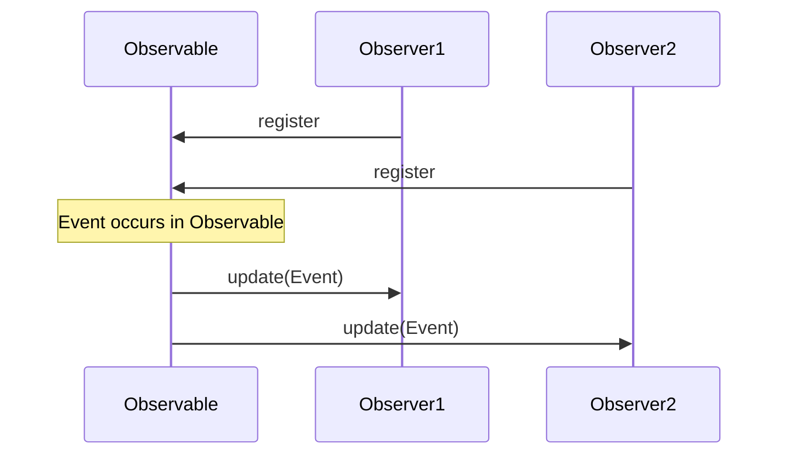

# Observer

The observer is publish-subscribe-pattern typically found in event-driven systems.
The observable maintains a list of observers and notifies them on events like changes in state.

## Weak reference

In the case that the observable holds a strong reference to an observer,
the observer would not be cleaned up by e.g garbage collection or reference counting if its life cycle ends.
This can be solved by weak references. 