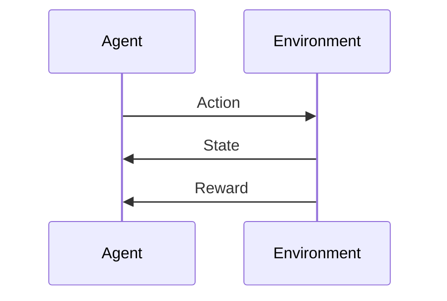

# Reinforcement learning

This note is about reinforcement learning (RL).

```mermaid
sequenceDiagram
  participant Agent
  participant Environment
  Agent->>Environment: Action
  Environment->>Agent: State
  Environment->>Agent: Reward
```
