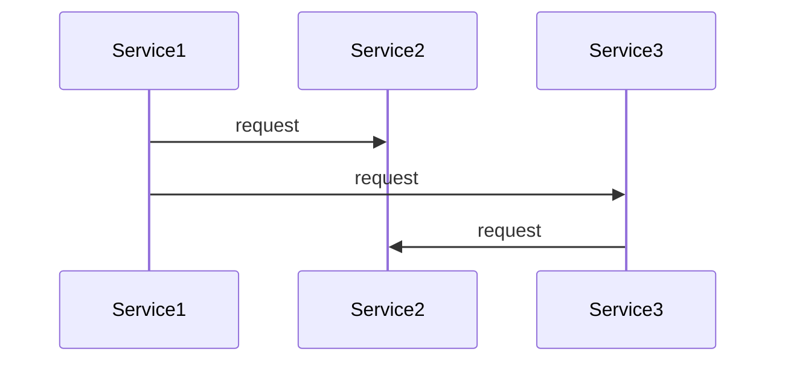
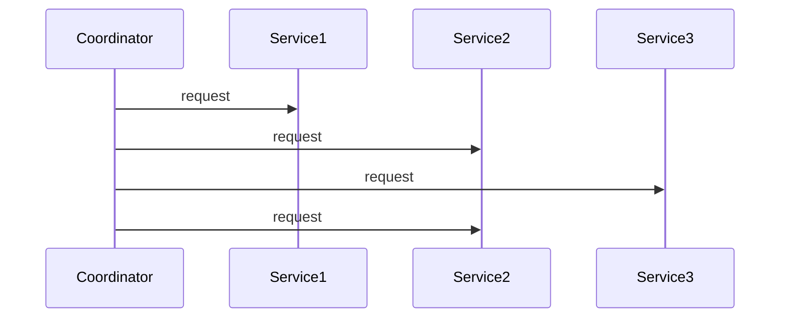

# Service interaction

This note describes interaction procedures used in microservice architectures.

## Choreography

In the choreography each service knows its role in a business process and therefore all following services it has to call.

__Note__: Response side suppressed for clarity.

## Orchestration

In the orchestration a business process is executed by a central coordinator. The services itself do not have to know the underlying business process.

__Note__: Response side suppressed for clarity.
